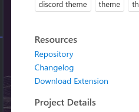
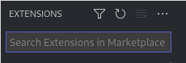

# discord-vscode-theme


# install 
Launch VS Code Quick Open (Ctrl+P), paste the following command, and press enter
```
ext install senpai1.discord-vscode-theme
```
## or install from vsix file

 Go [to](https://marketplace.visualstudio.com/items?itemName=senpai1.discord-vscode-theme)

Click "**Download Extension**" 



**open vscode extensions you can use (ctrl + shift + x)**

**Click the 3 dots** 



Choose the last option "install from VSIX" <br> 
find vsix file you downloaded
